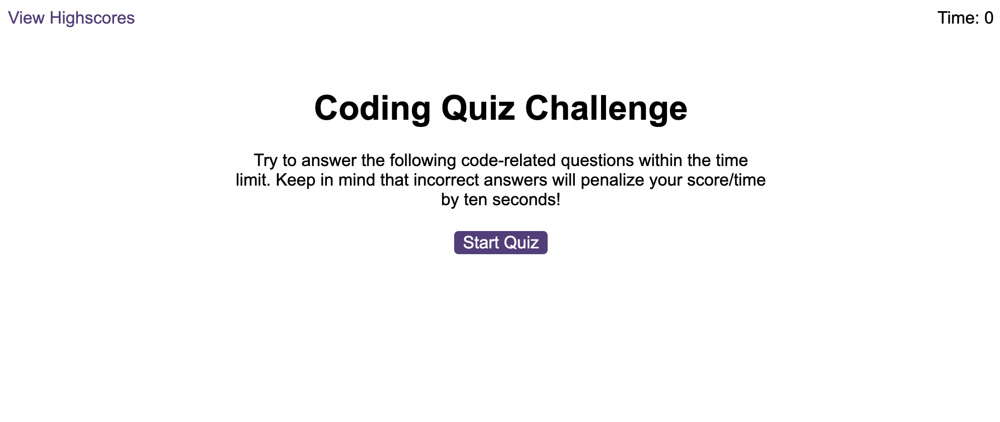
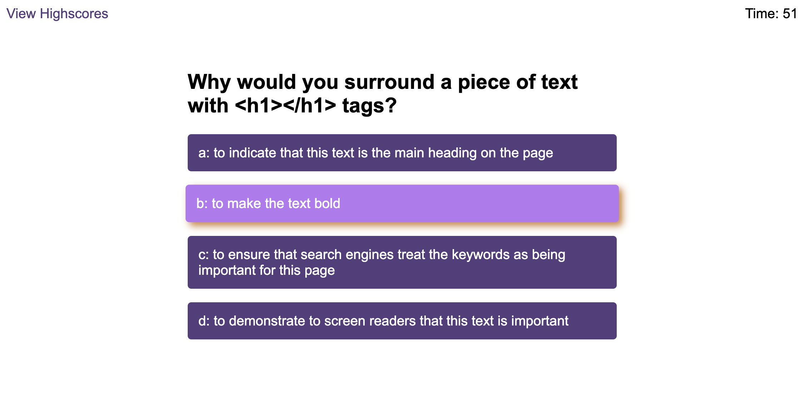
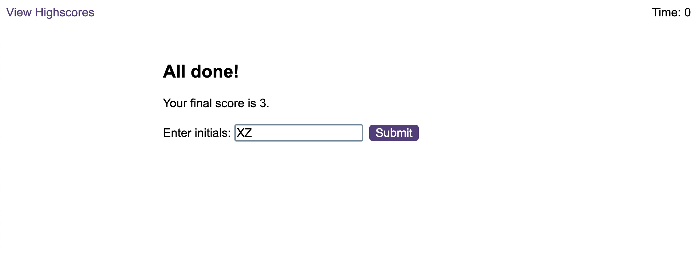
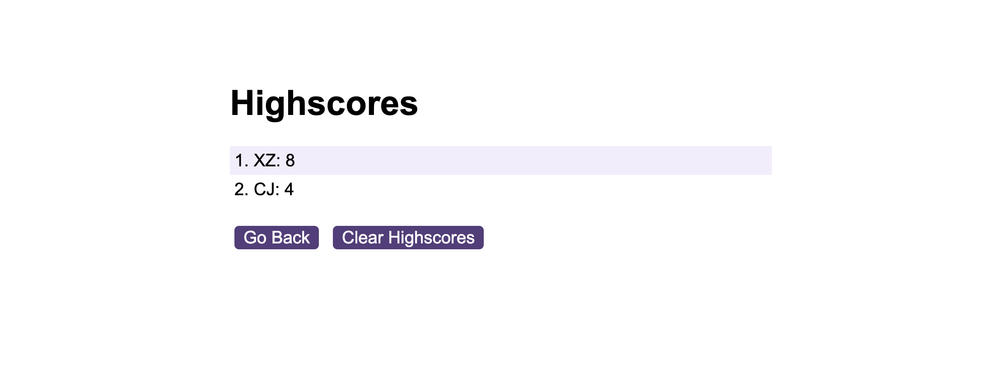

# Code-quiz
This application is to help the frontend development leaners to familiaze with multiple-choice questions, interactive coding and local storage. 

## Description
This application is based on a starter code to create a timed coding quiz with multiple-choice questions. It will run in the browser, which can dynamically updated HTML and CSS powered by JavaScript code.

## Main features
The timed quiz can store the scores from different users.
* When a start button is clicked, a timer is triggered and the first question appears.

* When the question choice is clicked, the next question appears.

* The choice is checked every time. A message and an audio effect will popup to tell the users if their choice is correct.

* When the choice is wrong, 10 seconds will be subtracted from the timer.

* The quiz will end when all questions are answered or the timer reaches 0.

* When the game ends, the users can save their initals and score.

* The users can view the high score list from different users.

* The application will have a clean, polished, and responsive user interface. 

## Deployment
Here are some screenshots of the application.

Click the link to test my webpage:

## Contribution
Xiao Zhao, zhaoxiao20071106@gmail.com

## Community
It's open-source. Feel free to use it for learning purpose.